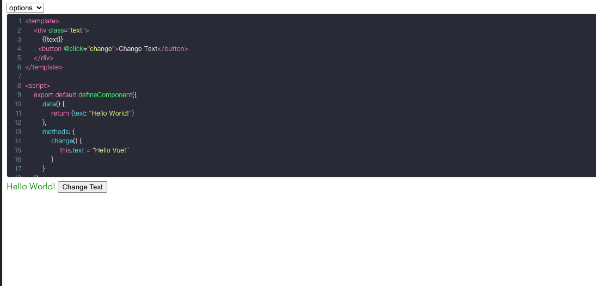
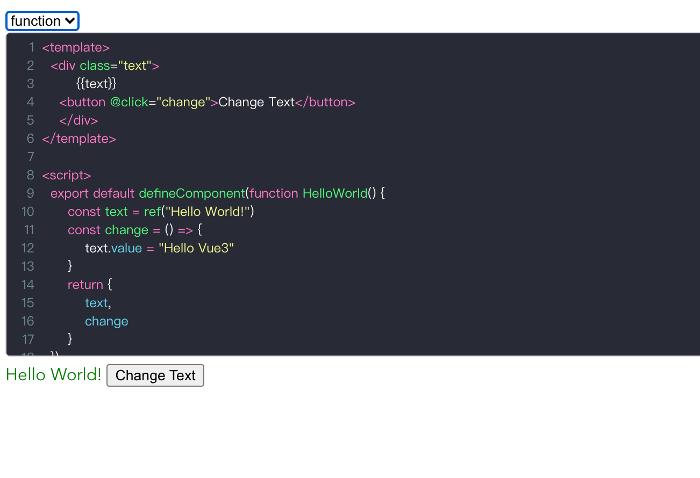

# vue3-live-editor

使用 Vue3 语法在线编辑运行

### 功能不完善且不稳定，仅供学习参考！！

支持 vue3 defineComponent options， setup Function 语法

例：

function 写法中可以打 debugger 调试

### function 写法中存在数据改变视图不更新的问题，怀疑是匿名函数作用域内的 Vue 实例与项目中的 Vue 实例不是同一个,或者匿名函数中根本没有 Vue 实例， 待解决。。。
